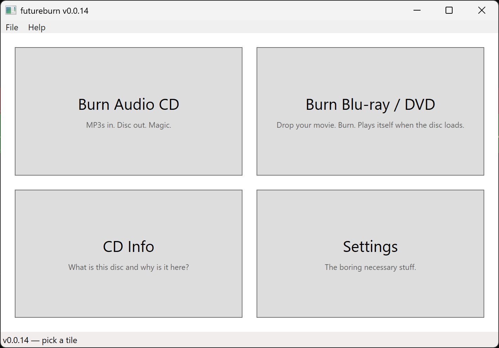
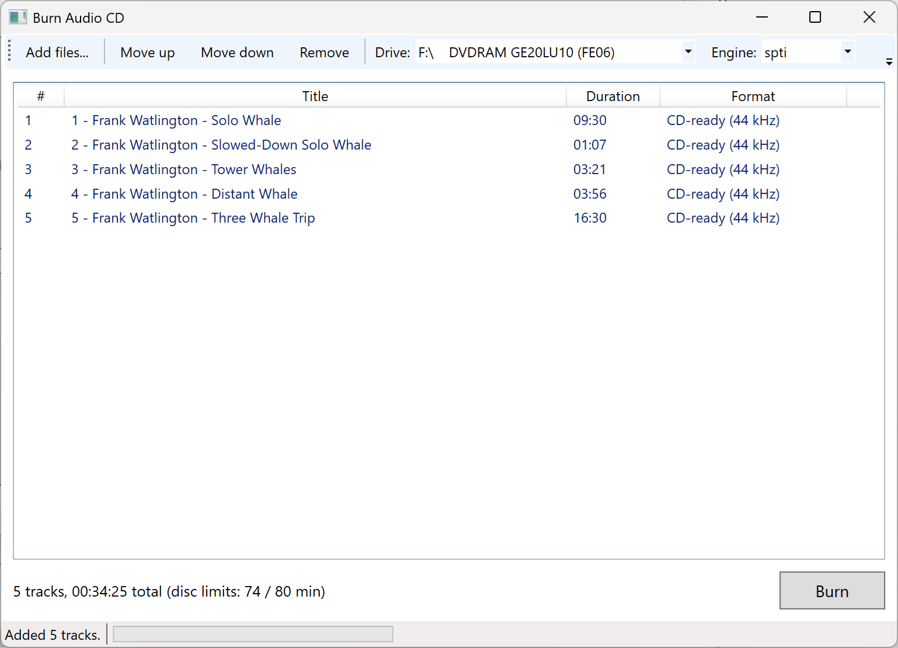
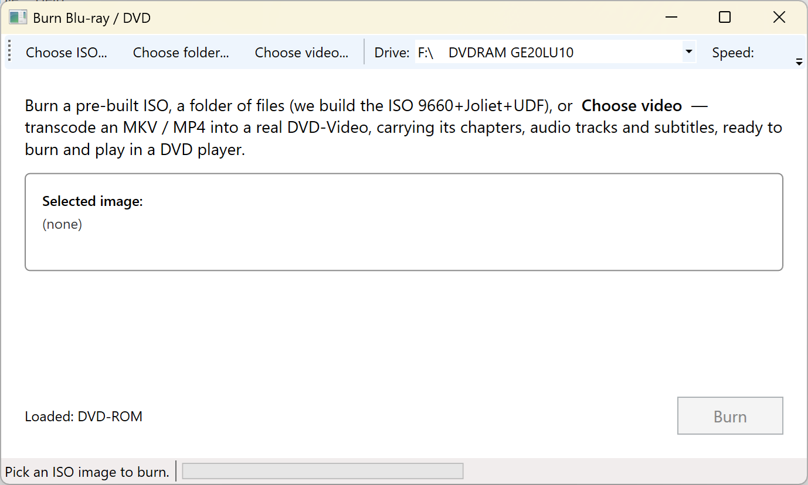
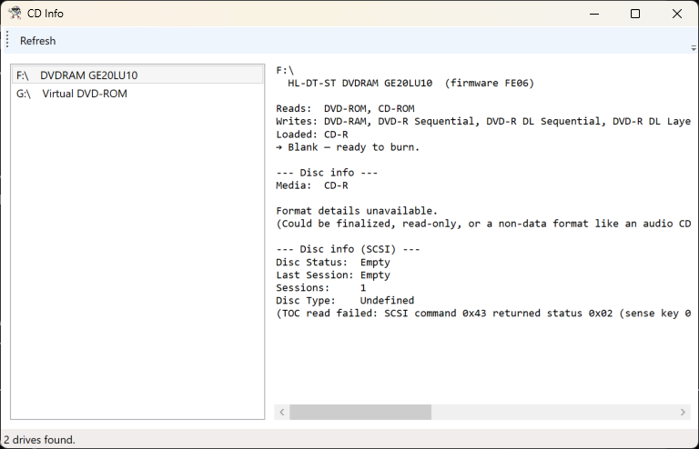
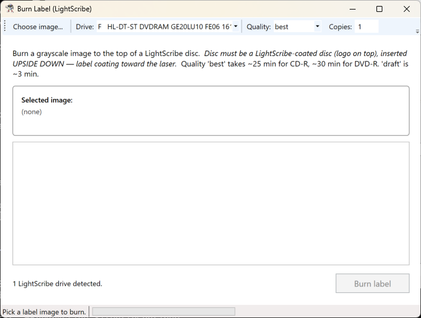

# futureburn

A free, modern, open-source CD/DVD burner for **Windows 11**. Both a command-line tool and a GUI. **MIT licensed. Free forever. No spyware, no installers, no bundled VPNs, no "free trial" nag screens, no telemetry, no accounts.**

> The current state of CD/DVD burning software in 2026 is grim. The "free" tools mostly come bundled with junkware — sneaky toolbar installers, "registry cleaners," VPN trial offers, telemetry. The "premium" ones charge subscription fees for software that hasn't meaningfully changed since 2008. This shouldn't be a market. **Optical disc burning is a solved engineering problem.** The Windows APIs and SCSI MMC commands needed are documented and stable. So here's the deal: futureburn is MIT-licensed, the code lives on GitHub, anyone can build it, fork it, ship it, audit it. **If anyone tries to sell you this software, they're scamming you.** Walk away.

A passion project that grew teeth.

---

## What works today

**Audio CDs**
- Burn Red Book audio CDs — single- or multi-track, verified playable in real players.
- Input from WAV, MP3, M4A, AAC, WMA, FLAC, and M3U / M3U8 playlists.
- Three burn engines — IMAPI v2, IMAPI v1, raw SPTI/SCSI — so you can use whatever your drive likes.

**Data & ISO discs**
- Burn ISO images to CD-R / DVD±R / DVD±RW / **BD-R / BD-RE**.
- Build an ISO 9660 + Joliet + UDF image from any folder, then burn it — in one step or two.
- Burn BIN/CUE data discs.

**Blu-ray**
- Burn Blu-ray discs — **BD-R** (single-layer, verified end-to-end on real hardware) and BD-RE. Sequential (SRM) recording with proper lead-out finalization.
- Author playable **Blu-ray (BD-Video)** from any video file — muxes to a UDF 2.50 BDMV image, auto-conforming non-Blu-ray video/audio with ffmpeg, and carrying chapters plus subtitles (SRT rendered to PGS). Burn it to BD-R in one step (`bd-author --burn`). Needs [tsMuxeR](https://github.com/justdan96/tsMuxer) + ffmpeg (located, not bundled).

**Video discs**
- Author hardware-playable **DVD-Video** from any video file — point it at an MKV and it carries chapters, every audio track, and subtitles through to a burned disc.
- **DVD menus** — root menu with Play / Scene Selection, plus a per-chapter scene menu.
- **DVD-Audio** authoring, and experimental Video CD authoring.

**Disc labels**
- **LightScribe** label burning — etch artwork onto the top side of the disc.
- One-shot labeled audio CD — burn the music *and* the label with a single command.

**Inspection & repair**
- Full drive + disc inspection — capabilities, media type, finalization status, complete TOC.
- **MusicBrainz** disc lookup, with a fuzzy TOC fallback for home-burned and older discs.
- Disc-folder validator — recognises DVD-Video, DVD-Audio, VCD, SVCD, Blu-ray, or plain data.
- Salvage partially-burned discs (`finalize`).

**Two ways to drive it**
- A full command-line tool, and a four-tile WPF GUI (every tile is wired and working).

See **[docs/](docs/)** for how each of these works under the hood.

## Coming later

- **CD-Text and true gapless DAO** — the encoder is complete and correct, but writing either one needs a drive that supports SAO cue-sheet recording. The test-bench LG GE20LU10 doesn't, so the burn path is built but awaits SAO-capable hardware. (`cuesheet-probe <drive>` tells you whether yours qualifies.)
- **Headless LightScribe submission** — works today via the LSS one-click dialog; fully programmatic submission is blocked on undocumented LSS internals.
- **UHD / HEVC Blu-ray authoring** — `bd-author` targets standard H.264 Blu-ray today; 4K UHD BD and HEVC passthrough are a later pass. Non-BD subtitle formats (VobSub) are also skipped for now.
- **Mac/Linux ports** — long after Windows is rock solid.

---

## Screenshots

The four-tile main window — pick what you want to do:



**Burn Audio CD** — drag in tracks, pick a drive, hit Burn. Background-thread burn with live progress and post-burn verification:



**Burn Blu-ray / DVD** — hand it a ready ISO or a folder, or hit **Choose video** and feed it an MKV / MP4 — it transcodes that into a real DVD-Video, chapters, audio tracks and subtitles and all, then burns a disc that plays in a DVD player:



**CD Info** — every optical drive and the disc in it: capabilities, what's loaded, a one-line suggested action (blank → ready to burn, finalized → ready to rip, ...), finalization status, and the complete TOC with per-track type and duration:



**Burn Label (LightScribe)** — drag in a picture, pick a LightScribe drive and a quality, hit Burn — the drive etches the artwork into the disc's top coating:



---

## Why this exists

A non-trivial chunk of the working internet still has CD/DVD drives plugged in and is producing physical media — for cars without aux jacks, for archival, for art objects, for the principle. The software market that serves these people is hostile by default. CD-burning shareware in 2026 is what shareware was in 2002, except the bundled spyware is more sophisticated.

**futureburn is an alternative**: open-source, no-strings, no-account-required, no-network-calls. The repo, the code, the binaries — all free. If you want to inspect every SCSI command we send to your drive, the code is right there. If you want to fork it and add a feature, please do. If you want to make money helping people burn discs, sell support contracts or USB writers, not the software.

---

## Engines

CD writing on Windows has three layers, and not all of them work on every drive. futureburn supports all three so we can pick whatever the hardware likes:

| Flag | Layer | Use when |
|---|---|---|
| `--engine v2` *(default)* | IMAPI 2 (the modern Windows COM API, `MsftDiscFormat2TrackAtOnce`) | Most modern drives. Just works. |
| `--engine v1` | IMAPI 1 (legacy XP-era COM, `MsDiscMasterObj` + `IRedbookDiscMaster`) | When v2 returns "mode page not present" or fails for unclear reasons on an old drive. |
| `--engine spti` | Raw SCSI Pass-Through (`IOCTL_SCSI_PASS_THROUGH_DIRECT` + MMC opcodes) | When both IMAPI versions are uncooperative. Same approach as ImgBurn. **This is the engine that successfully wrote our first real audio CD.** |

Run the diagnostics to find out which one your drive likes:

```powershell
futureburn drives -v          # full capability dump for every drive
futureburn cd-info F          # finalization status + TOC for the disc in F:
futureburn imapi-v1-info      # is IMAPI v1 functional on this PC?
futureburn spti-info F        # does raw SCSI pass-through work on F:?
```

---

## Stack

- **Language:** C# (.NET 8), **GUI:** WPF
- **Audio:** [NAudio](https://github.com/naudio/NAudio) (MIT) for decoding + resampling
- **Burning:** IMAPI v2 + v1 via hand-rolled `[ComImport]` interfaces (no NuGet wrappers); SPTI via direct P/Invoke and SCSI MMC opcodes
- **External tools (optional, for video discs):** `ffmpeg`, `dvdauthor`, `spumux`, `dvda-author`
- **Target OS:** Windows 11 (Win10 likely works, not a goal)
- **Third-party NuGet packages:** NAudio. That's it. No installer, no telemetry SDK, no analytics package.

---

## Running it

```powershell
# Drives + capabilities
dotnet run --project src/Futureburn.Cli -- drives -v

# Disc inspection
dotnet run --project src/Futureburn.Cli -- cd-info F

# Burn an audio CD
dotnet run --project src/Futureburn.Cli -- burn mix.m3u8 F: --engine spti --speed 16x

# Burn an ISO, or build+burn an ISO from a folder
dotnet run --project src/Futureburn.Cli -- burn-iso ubuntu.iso F: --yes
dotnet run --project src/Futureburn.Cli -- burn-folder "C:\my-files" F: --label MYDISC

# Author a DVD-Video from an MKV and burn it in one go
dotnet run --project src/Futureburn.Cli -- dvdv-author movie.mkv .\out --menu --burn F:

# LightScribe a label
dotnet run --project src/Futureburn.Cli -- lightscribe-print F .\cover.png

# GUI
dotnet run --project src/Futureburn.Gui
```

Run `futureburn` with no arguments for the full command list. The GUI opens to a four-tile main window — Burn Audio CD, Burn Blu-ray / DVD, CD Info, and Burn Label (LightScribe) — all four are live.

---

## Repository layout

```
futureburn/
├── Futureburn.sln
├── Directory.Build.props            # one place to bump version, set framework, etc.
├── CHANGELOG.md
├── docs/                            # how-it-works documentation
├── LICENSE                          # MIT
└── src/
    ├── Futureburn.Core/
    │   ├── Imapi/                   # IMAPI v2 + v1 typed COM, drive enum, disc inspection
    │   ├── Spti/                    # SCSI pass-through: interop, MMC opcodes, burn engines, CD-Text
    │   ├── Audio/                   # NAudio wrappers, M3U parser, CD format constants
    │   ├── Fs/                      # ISO 9660 / Joliet / UDF image building, disc-folder validator
    │   ├── Image/                   # BIN/CUE parsing and image streams
    │   ├── Authoring/               # DVD-Video / DVD-Audio / VCD authoring, IFOs, menus
    │   ├── Ffmpeg/                  # ffmpeg / ffprobe detection and invocation
    │   ├── Tools/                   # external-tool locators + runners (dvdauthor, spumux, ...)
    │   ├── LightScribe/             # LSPrintAPI interop, label-image conversion
    │   └── Net/                     # MusicBrainz client
    ├── Futureburn.Cli/              # all the commands
    └── Futureburn.Gui/              # WPF — main window + four feature windows
```

---

## Versioning

One number, one place — `<Version>` in `Directory.Build.props`. Every project picks it up. The CLI prints its version on every invocation; the GUI shows it in the title bar and About dialog.

Per-version changelog entries live in [CHANGELOG.md](./CHANGELOG.md).

---

## Contributing

Pull requests welcome. Issues welcome. If you have a quirky drive that doesn't work, open an issue with the output of `futureburn drives -v` and `futureburn imapi-v1-info` and we'll add a workaround.

If you build a feature, please match the existing tone in code comments — explanatory where the *why* isn't obvious (especially for SCSI/COM/IMAPI quirks) and otherwise let the names speak.

---

## License

[MIT](./LICENSE). Free for everyone, forever. Use it, fork it, ship it, sell hardware bundled with it. Just don't sell *the software itself* and pretend it's not free — there are too many people doing that already.

No warranty. No promises. Burns at your own risk.
